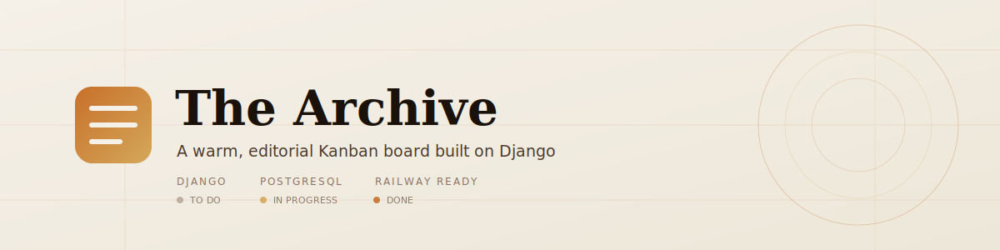
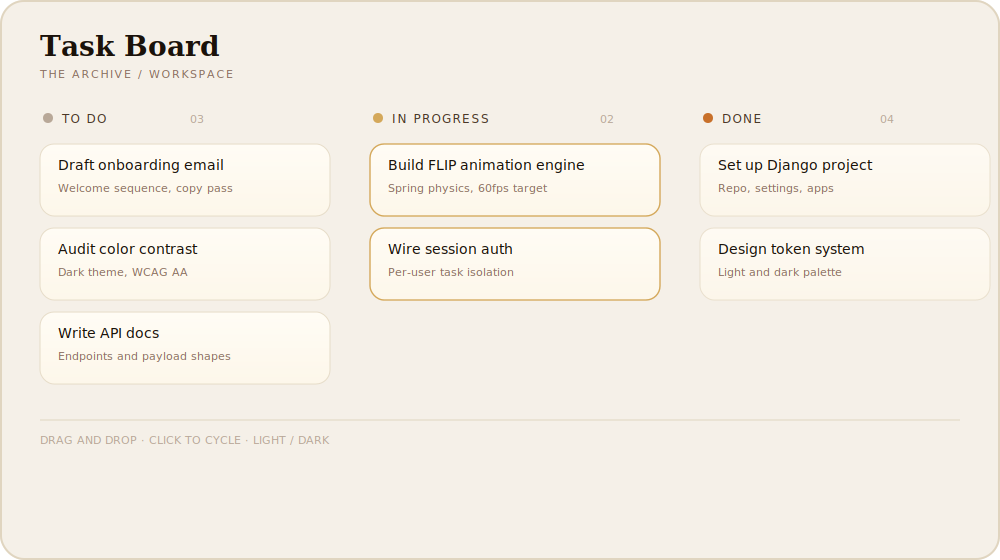
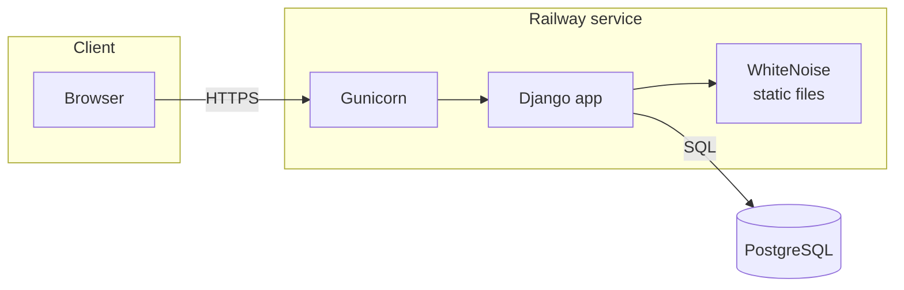
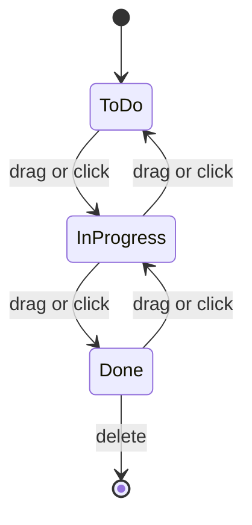

<div align="center">



<br/><br/>

**An open source Kanban task board with an editorial interface, built on Django and PostgreSQL.**

Drag and drop task management, animated state transitions, and a warm, distraction-free design system, packaged as a self-hosted project management tool you can deploy in minutes.

<br/>

[](https://www.python.org/)
[](https://www.djangoproject.com/)
[](https://www.postgresql.org/)
[](https://railway.app/new)
[](LICENSE)

</div>

<br/>

<div align="center">
  
</div>

<br/>

## Contents

- [Why The Archive](#why-the-archive)
- [Features](#features)
- [Architecture](#architecture)
- [Tech stack](#tech-stack)
- [Project structure](#project-structure)
- [Getting started locally](#getting-started-locally)
- [Environment variables](#environment-variables)
- [Deploying to Railway](#deploying-to-railway)
- [API reference](#api-reference)
- [Design system](#design-system)
- [Roadmap](#roadmap)
- [Contributing](#contributing)
- [License](#license)

<br/>

## Why The Archive

Most self-hosted Kanban boards either ship as a heavy multi-service stack or as a bare-bones CRUD app with no visual identity. The Archive sits in between: a single Django project, one PostgreSQL database, zero background workers, and a hand-built design system that feels closer to an editorial magazine than a default admin panel.

It is a good fit if you want:

- A lightweight, self-hosted task manager for one user or a small team, without Trello or Jira overhead
- A reference implementation of a clean Django project ready for platforms like Railway, Render, or Fly.io
- A starting point for a custom internal tool where the UI actually matters

<br/>

## Features

| | |
|---|---|
| **Three-column workflow** | To Do, In Progress, and Done, with drag and drop or click to cycle between states |
| **Motion system** | FLIP-based animations with a custom spring physics engine, no animation library involved |
| **Light and dark themes** | Persisted through `localStorage`, with automatic detection through `prefers-color-scheme` |
| **Session authentication** | Django's built-in auth, with tasks fully isolated per user |
| **JSON API** | A small REST-style surface for creating, updating, and deleting tasks |
| **Production ready** | WhiteNoise for static files, Gunicorn as the app server, environment-driven settings, and a Railway deploy path out of the box |

<br/>

## Architecture

The Archive runs as a single Django service backed by PostgreSQL. There is no queue, no cache layer, and no separate frontend build step, which keeps the deployment surface small and easy to reason about.



Task state changes follow a simple, predictable flow:



<br/>

## Tech stack

| Layer | Technology |
|---|---|
| Backend framework | Django 6 |
| Language | Python 3.12 |
| Database | PostgreSQL |
| App server | Gunicorn |
| Static files | WhiteNoise, with compressed manifest storage |
| Frontend | Vanilla JavaScript (ES2022), a custom CSS design system |
| Typography | Playfair Display, DM Sans, DM Mono |
| Animation | FLIP technique with a hand-written spring physics engine |
| Auth | Django's built-in session authentication |
| Deployment | Railway, via Nixpacks and `railway.toml` |

<br/>

## Project structure

```txt
collaboration_app/
├── collaboration/                 # Application package
│   ├── static/collaboration/
│   │   ├── css/style.css          # Design system and theme tokens
│   │   └── js/tasks.js            # Theme logic, board interactions, API calls
│   ├── templates/
│   │   ├── collaboration/index.html
│   │   └── registration/login.html
│   ├── admin.py
│   ├── models.py                  # Task model
│   ├── urls.py
│   └── views.py                   # Board views and JSON API endpoints
├── collaboration_app/             # Project package
│   ├── settings.py                # Environment driven configuration
│   ├── urls.py
│   ├── wsgi.py
│   └── asgi.py
├── docs/assets/                   # README diagrams and illustrations
├── .env.example
├── manage.py
├── railway.toml                   # Build, pre-deploy migrations, and start command
└── requirements.txt
```

<br/>

## Getting started locally

**Prerequisites:** Python 3.12+, PostgreSQL 14+, and `pip`.

```bash
# Clone the repository
git clone https://github.com/<your-username>/the-archive.git
cd the-archive/collaboration_app

# Create and activate a virtual environment
python -m venv venv
source venv/bin/activate      # Windows: venv\Scripts\activate

# Install dependencies
pip install -r requirements.txt

# Configure environment variables
cp .env.example .env
# then edit .env with your local database credentials and a real SECRET_KEY

# Apply migrations
python manage.py migrate

# Create an admin user
python manage.py createsuperuser

# Run the development server
python manage.py runserver
```

The board is available at `http://127.0.0.1:8000/` once you log in.

<br/>

## Environment variables

All configuration is read from environment variables, loaded from `.env` locally through `python-dotenv`. See [`.env.example`](.env.example) for the full template.

| Variable | Required | Description |
|---|---|---|
| `SECRET_KEY` | Yes | Django's cryptographic signing key. Generate a unique value per environment. |
| `DEBUG` | No | `True` locally, `False` in production. Defaults to `False`. |
| `ALLOWED_HOSTS` | Production | Comma separated list of hostnames allowed to serve the app. |
| `DATABASE_URL` | Production | Full PostgreSQL connection string. On Railway this is not linked automatically. Add it to the web service as `${{Postgres.DATABASE_URL}}`, referencing your Postgres service by name. |
| `DB_NAME`, `DB_USER`, `DB_PASSWORD`, `DB_HOST`, `DB_PORT` | Local dev | Used only when `DATABASE_URL` is not set. |
| `CSRF_TRUSTED_ORIGINS` | Production | Comma separated list of trusted origins, needed behind a custom domain. |

<br/>

## Deploying to Railway

The Archive ships with everything Railway needs out of the box: a `requirements.txt` and a `railway.toml` that builds the app, collects static files, runs migrations right before each deploy, and then starts Gunicorn. There is no Procfile. Nixpacks reads a Procfile's `release` line during the Docker image build, before any database is attached, so migrations belong in `preDeployCommand` instead, which runs after the image is built and the database is reachable.

1. **Create a new project** on [Railway](https://railway.app/new) and deploy from this GitHub repository.
2. **Add a PostgreSQL database** to the project. Railway creates a `Postgres` service with its own `DATABASE_URL`, but does not attach it to your web service automatically.
3. **Link the database to the web service** by adding a `DATABASE_URL` variable on the web service that references the Postgres service, rather than typing in a raw connection string:
   ```
   DATABASE_URL=${{Postgres.DATABASE_URL}}
   ```
   In the dashboard: open the web service, go to **Variables**, add `DATABASE_URL`, and pick the Postgres service's `DATABASE_URL` from the reference picker (or paste `${{Postgres.DATABASE_URL}}` directly, using the actual name of your Postgres service if you renamed it). From the CLI:
   ```bash
   railway variables --set 'DATABASE_URL=${{Postgres.DATABASE_URL}}'
   ```
   Without this, `settings.py` finds no `DATABASE_URL` and falls back to the local dev defaults (`127.0.0.1:5432`), which does not exist inside the Railway container and makes `preDeployCommand` fail with a connection error.
4. **Set the remaining required variables** on the web service: at minimum `SECRET_KEY` and `DEBUG=False`. Railway also sets `RAILWAY_PUBLIC_DOMAIN`, which the app automatically trusts for `ALLOWED_HOSTS` and CSRF.
5. **Deploy.** Railway runs `pip install -r requirements.txt` and `python manage.py collectstatic --noinput` during the build, then `python manage.py migrate --noinput` as the `preDeployCommand` right before starting Gunicorn.
5. **Create a superuser** from the Railway shell:
   ```bash
   railway run python manage.py createsuperuser
   ```

The service exposes a `/health/` endpoint used for Railway's health checks, so failed deploys roll back automatically instead of leaving a broken instance live.

<br/>

## API reference

All endpoints return JSON and require an authenticated session. `POST` requests require a valid CSRF token.

| Method | Endpoint | Description |
|---|---|---|
| `GET` | `/api/tasks/` | List all tasks for the authenticated user |
| `POST` | `/api/tasks/create/` | Create a new task |
| `POST` | `/api/tasks/update/` | Update a task's status or title |
| `POST` | `/api/tasks/delete/` | Delete a task |
| `GET` | `/health/` | Liveness check used by Railway |

**Create a task**

```json
{ "title": "Task title", "description": "", "status": "todo" }
```

**Update a task**

```json
{ "id": 1, "status": "in_progress" }
```

**Delete a task**

```json
{ "id": 1 }
```

<br/>

## Design system

The interface is built entirely from CSS custom properties, no component library involved. Every color, from the warm amber accent to the parchment background, is a token defined once and swapped instantly through a `data-theme` attribute on `<html>`.

- **Palette:** amber, terracotta, and gold accents over a parchment or espresso base, depending on theme
- **Typography:** Playfair Display for headings, DM Sans for interface text, DM Mono for metadata and counters
- **Motion:** task movement is animated with the FLIP technique, recording the first position, applying the DOM change, calculating the delta, and animating back into place through a custom spring

<br/>

## Roadmap

- [ ] Task labels and priority levels
- [ ] Due dates with reminders
- [ ] Multi-user boards with shared workspaces
- [ ] Optional realtime sync (the API and models are already structured for it)

Have an idea that is not listed here? Open an issue and describe the use case.

<br/>

## Contributing

Contributions, issues, and feature requests are welcome.

1. Fork the repository
2. Create a feature branch: `git checkout -b feature/your-feature`
3. Commit your changes with a clear message
4. Open a pull request describing what changed and why

If you run into a bug, please include steps to reproduce it and, if relevant, your Django and PostgreSQL versions.

<br/>

## License

Distributed under the MIT License. See [`LICENSE`](LICENSE) for the full text.

<br/>

<div align="center">
  <sub>Built with Django, a custom motion system, and an editorial design system, one column at a time.</sub>
</div>
