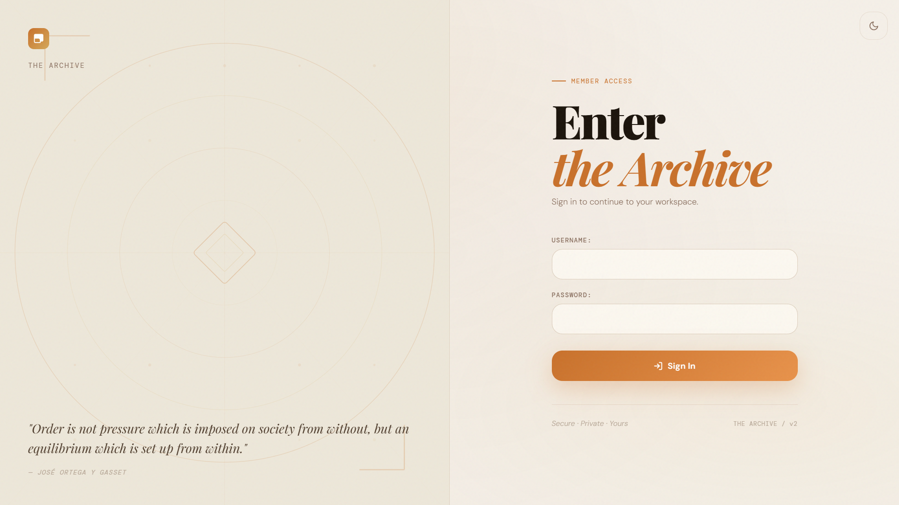
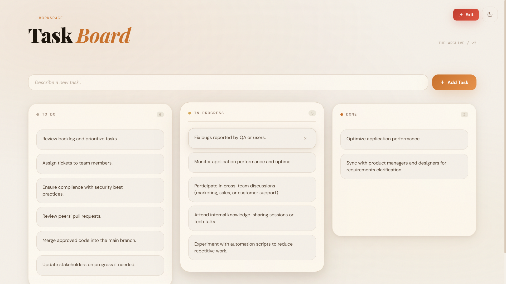

<div align="center">

<br/>

# The Archive

**A Kanban task board with editorial design built on Django.**

Persistent task management with drag-and-drop interactions, animated state transitions, and a warm editorial UI served through a standard Django architecture without external infrastructure dependencies.

<br/>


</div>

---

## Screenshots

<table>
  <tr>
    <td align="center"><b>Login</b></td>
    <td align="center"><b>Task Board · Light Theme</b></td>
  </tr>
  <tr>
    <td></td>
    <td></td>
  </tr>
</table>

---

## Overview

The Archive is a single-user Kanban board focused on interface craftsmanship and clean Django architecture. Tasks move across three columns: **To Do**, **In Progress**, and **Done** through drag-and-drop interactions or click-to-cycle controls with spring-based motion animations.

The frontend design system is built entirely from scratch using a warm amber and terracotta palette, editorial typography, persistent light and dark themes, and a responsive glass-surface layout.

---

## Features

- Three-column Kanban workflow with To Do, In Progress, and Done states
- Drag-and-drop task movement between columns
- Click-to-cycle task progression
- FLIP-based motion animations with custom spring physics
- Persistent light and dark mode support using `localStorage`
- Automatic theme detection through `prefers-color-scheme`
- Django session authentication with per-user task isolation
- REST-style JSON API for task creation, updates, and deletion
- Runs entirely on Django with PostgreSQL and no external runtime services

---

## Tech Stack

| Layer | Technology |
|---|---|
| Backend Framework | Django 6 |
| Language | Python 3.12 |
| Database | PostgreSQL |
| Frontend | Vanilla JavaScript (ES2022), Custom CSS Design System |
| Typography | Playfair Display, DM Sans, DM Mono |
| Animation | FLIP animation technique with custom spring physics |
| Authentication | Django built-in authentication |
| Server | Django development server (`runserver`) |

---

## Project Structure

```txt
collaboration/
├── static/
│   └── collaboration/
│       ├── css/
│       │   └── style.css          # Design system and theme tokens
│       └── js/
│           └── tasks.js           # Theme logic, board interactions, API calls, animations
├── templates/
│   └── collaboration/
│       ├── index.html             # Main task board
│       └── login.html             # Authentication page
├── views.py                       # Board views and JSON API endpoints
├── models.py                      # Task model
├── urls.py
└── consumers.py                   # Inactive WebSocket consumer
````

---

## API Endpoints

All endpoints expect and return JSON. CSRF tokens are required for all `POST` requests.

| Method | Endpoint             | Description                                   |
| ------ | -------------------- | --------------------------------------------- |
| `GET`  | `/api/tasks/`        | Retrieve all tasks for the authenticated user |
| `POST` | `/api/tasks/create/` | Create a new task                             |
| `POST` | `/api/tasks/update/` | Update task status                            |
| `POST` | `/api/tasks/delete/` | Delete a task                                 |

### Create Payload

```json
{ "title": "Task title", "description": "", "status": "todo" }
```

### Update Payload

```json
{ "id": 1, "status": "in_progress" }
```

### Delete Payload

```json
{ "id": 1 }
```

---

## Design System

The interface is powered by a custom CSS design system without external component libraries.

### Color Palette

A warm editorial palette built around amber, terracotta, parchment, and espresso tones. Every color is defined through CSS variables, enabling instant theme switching through a single `data-theme` attribute on `<html>`.

### Typography

The UI uses a three-font editorial stack:

* `Playfair Display` for headings and large titles
* `DM Sans` for body text and interface controls
* `DM Mono` for metadata, counters, and labels

### Motion System

Task movement uses the FLIP animation technique by recording the first position, applying DOM changes, calculating positional deltas, and animating elements back into place through a custom spring physics engine.

No animation libraries are used.

---

## Architecture Notes

The project originally used a realtime ASGI architecture with Django Channels, Redis, and Docker orchestration. That infrastructure was later removed in favor of a simpler synchronous Django setup focused on maintainability and portability.

The existing REST API and task model remain structured for future realtime expansion if WebSocket support is reintroduced later.

---

## Closing Notes

The Archive was designed as a study in interface polish, frontend motion systems, and clean backend architecture using only foundational web technologies.

The project emphasizes clarity, responsiveness, and visual warmth while maintaining a lightweight deployment model that runs entirely through standard Django tooling.

<br/>

<div align="center">

Built with Django, thoughtful motion design, and editorial-inspired UI principles.

</div>

